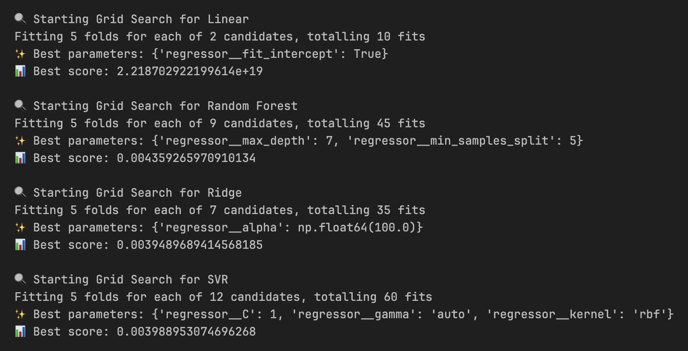
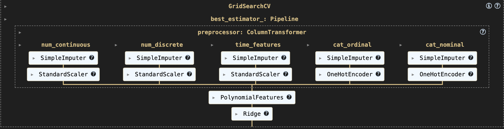
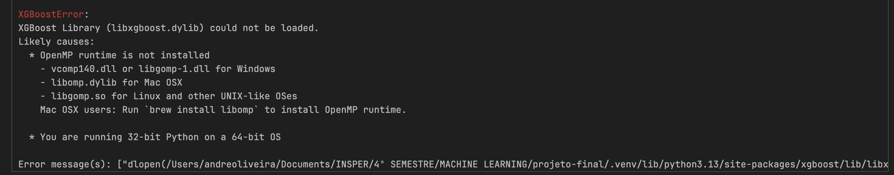
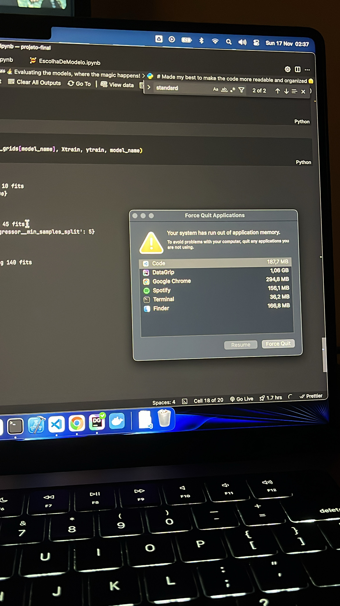

# 🏠 Ames Housing Price Prediction Project

This project was developed as part of the **Machine Learning** course at **Insper**. The goal was to apply regression techniques to predict housing prices using the **Ames Housing Dataset**. The project aimed to demonstrate proficiency in data preprocessing, feature engineering, model selection, and evaluation.

## 🚀 Project Overview
The focus of this project was to build a regression pipeline capable of accurately estimating property prices. By experimenting with various machine learning models and techniques, I refined the predictive capabilities.

Key objectives included:
- Evaluating multiple regression models.
- Implementing hyperparameter tuning for optimal performance.
- Selecting the best model based on Mean Squared Error (MSE) and R² scores.
- Analyzing the results to derive meaningful business insights.

## 💣 SELECTED MODEL - RIDGE REGRESSOR:
- [Evaluating notebook](project/evaluating.ipynb)

- The models evaluated were:
    - 🌲 *Random Forest Regressor*
    - 🎯 *SVR*
    - 👎 *Linear Regression* 
    - 🦾 *Ridge Regressor*

#### 🧠 PERFORMANCE:

- As we can see, the best model was the **Ridge Regressor** with a *Mean Squared Error* of ~0.00395. Resulting in a score of ~0.914 in the test set. 🎉 (Probaly because it uses the L2 regularization to avoid overfitting, [I couldn't go deeply
into it, but I know that it helps to avoid overfitting by penalizing the weights of the model, because it makes the biggest weights smaller 🤔 (ref. 8)])

*Final Ridge Regressor Pipeline Schema*

#### 🫠 FEATURE SELECTION:
- In this case we couldn't use the **Ridge Regressor** to select the best features, because of the nature of the model (It does not "waste any predictive information trying to determine which variables have exactly zero effect.", ref. 7)

#### 💼 BUSSINESS APPLICATION:
- In business perspective, the **Ridge Regressor** could be used in the following ways:
    - 💼 **Improve market strategies**: by predicting the price of the houses, a real estate broker could make better decisions about how to position the properties in the market.
    - ⬇️ **Risk Reduction**: avoid overpricing or underpricing properties, which could lead to financial losses.
    - 😎 **Operational Efficiency**:Instead of expending significant effort calculating and estimating house prices manually, real estate brokers can save time and money by using the predictor I developed. It provides a quick indication of whether further investigation and research are worth.
- **OBS:** It is important to remember that the model is not perfect and should not be used as a tool to decision-making. It is just a study case made by me. 📚 

## 👀 OBSERVATIONS:
- I really tried to use XGBoost, but I couldn't make it work. 😩
    - Something with the lib and python compatibility:
    

- I tried to expand the grid search, but it was taking too long to run and sometimes it was crashing my intire computer. (Be careful with that) 🔥
    

## 📖 REFERENCES:
- 1. *Mãos À Obra: Aprendizado de Máquina com Scikit-Learn E TensorFlow* (https://g.co/kgs/YhsmTi3)
- 2. https://scikit-learn.org/1.5/modules/generated/sklearn.impute.SimpleImputer.html
- 3.  I used Claude Sonnet 3.5 to format and make the markdown cells more beautiful. (I am horrible at markdown styling 😩)
- 4. Many thanks to those videos that helped me understand the concepts of the algorithms: 
    - https://www.youtube.com/watch?v=het9HFqo1TQ&t=2734s&ab_channel=StanfordOnline
    - https://www.youtube.com/watch?v=EESZtSOdhEQ&t=704s&ab_channel=PedramJahangiry
    - https://www.youtube.com/watch?v=OtD8wVaFm6E&ab_channel=StatQuestwithJoshStarmer
    - https://www.youtube.com/watch?v=J4Wdy0Wc_xQ&t=513s&ab_channel=StatQuestwithJoshStarmer & https://www.youtube.com/watch?v=v6VJ2RO66Ag&ab_channel=NormalizedNerd
    - https://www.youtube.com/watch?v=GrJP9FLV3FE&ab_channel=StatQuestwithJoshStarmer
- 5. https://xgboost.readthedocs.io/en/stable/python/python_intro.html
- 6. https://www.ibm.com/topics/ridge-regression
- 7. https://stats.stackexchange.com/questions/506397/how-to-select-the-best-feature-set-from-ridge-regression - Very helpful to understand that the Ridge Regression is not the best model for feature selection.
- 8. https://www.youtube.com/watch?v=OLl2nzOeQ68&ab_channel=CIS522-DeepLearning
- 9. Used Claude Sonnet 3.5 to write the project overview.
## 👥 AUTHORS
- Andre Pereira de Oliveira (andrepo@al.insper.edu.br)